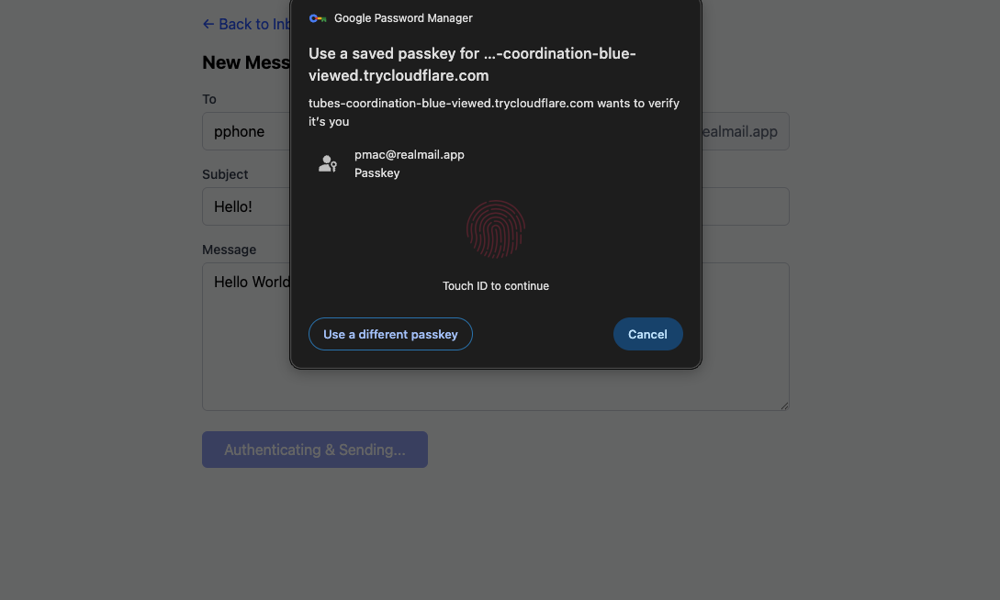
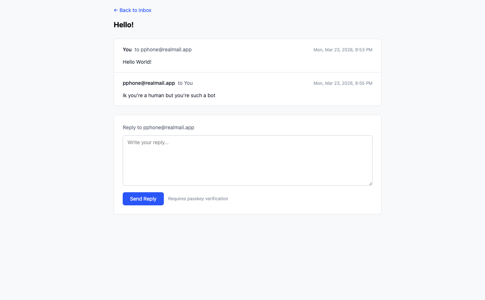

# RealMail

Human to human messaging with biometric auth. Every action — signup, login, and sending messages — requires WebAuthn passkey verification (Touch ID, Face ID, Windows Hello, or a hardware security key).

Sending a message requires WebAuthn verification:



Email-style thread view with passkey-verified replies:



## Setup

```bash
npm install
```

## Local development

```bash
npm run dev
```

Open http://localhost:3000. Passkey auth works on `localhost` without HTTPS.

## Cross-device testing

To test between your computer and phone, you need an HTTPS tunnel. Passkeys require a secure origin.

1. Install [cloudflared](https://developers.cloudflare.com/cloudflare-one/connections/connect-networks/get-started/create-local-tunnel/):
   ```bash
   brew install cloudflared
   ```

2. Start the tunnel:
   ```bash
   cloudflared tunnel --url http://localhost:3000
   ```
   This prints a URL like `https://some-words.trycloudflare.com`.

3. In a separate terminal, start the server with the tunnel's domain:
   ```bash
   RP_ID=some-words.trycloudflare.com ORIGIN=https://some-words.trycloudflare.com npm run tunnel
   ```
   `npm run tunnel` builds for production first — required because dev mode's hot-reload breaks through tunnels.

4. Open the tunnel URL on both devices. Register a different account on each, then message between them.

> **Note:** `RP_ID` and `ORIGIN` tell WebAuthn which domain the passkeys belong to. They must match the tunnel URL exactly. Each time `cloudflared` restarts, you get a new random domain — passkeys registered on the old domain won't work, so you'll need to re-register accounts. To avoid this, use a stable tunnel domain (e.g. a free [ngrok](https://ngrok.com) account or a [named Cloudflare Tunnel](https://developers.cloudflare.com/cloudflare-one/connections/connect-apps/install-and-setup/tunnel-guide/local/)).
